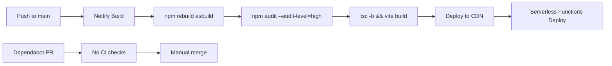

# DevOps & Infrastructure Audit Report

**Report**: #27 — DevOps Audit
**Run**: 01
**Date**: 2026-03-13 10:20
**Branch**: `devops-audit-2026-03-13`
**Baseline Tests**: 279/279 passing

---

## 1. Executive Summary

**Overall Health**: Good for the project's scope (static SPA + single serverless function on Netlify). The infrastructure is lightweight by design — no database, no Docker, no complex CI/CD pipelines. The main risks are operational: no GitHub Actions CI pipeline, missing `.env.example`, and limited observability in the serverless function.

### Top 5 Improvements

1. **No CI pipeline** — Netlify build is the only automated check. No PR-level testing, linting, or type-checking.
2. **Missing `.env.example`** — New developers have no reference for required environment variables.
3. **No structured logging** — Server function uses raw `console.error` with no structured metadata.
4. **No GitHub Actions workflow** — Dependabot PRs merge without CI validation.
5. **Rate limiter is ephemeral** — In-memory map resets on every cold start (known, acceptable for scale).

### Quick Wins Implemented

- Created `.env.example` with documented variables.

---

## 2. CI/CD Pipeline

### 2.1 Pipeline Inventory

This project has **no CI/CD pipeline** in the traditional sense. There are:

- **No GitHub Actions workflows** (`.github/workflows/` does not exist)
- **No GitLab CI, CircleCI, Jenkins, or Azure Pipelines** configs
- **Dependabot** (`dependabot.yml`) configured for weekly npm updates — but PRs have no CI to validate them

The only automated build/deploy is **Netlify's build pipeline**, triggered on push to `main`:



### 2.2 Netlify Build Analysis

**Build command**: `npm rebuild esbuild && npm audit --audit-level=high && npm run build`

| Step | Purpose | Notes |
|------|---------|-------|
| `npm rebuild esbuild` | Workaround for `ignore-scripts=true` in `.npmrc` | Necessary — esbuild needs native binary |
| `npm audit --audit-level=high` | Fail on high/critical vulnerabilities | Good practice, but blocks deploys on upstream issues |
| `tsc -b` | TypeScript type checking | Good |
| `vite build` | Production bundle | Good |

**Missing from build**: Tests (`npm test`) are not run in the Netlify build. The 279 tests only run locally.

### 2.3 Optimizations Identified

| Optimization | Impact | Safe to Implement? |
|---|---|---|
| Add GitHub Actions CI workflow | PR validation (test, lint, typecheck) | Yes — but significant new config |
| Add `npm test` to Netlify build | Catch regressions before deploy | Moderate risk — increases build time by ~30s |
| Add path filters for Dependabot | Skip rebuild for docs-only changes | N/A — no CI to filter |

### 2.4 Recommendations

**High Priority**: Add a GitHub Actions workflow for PR checks:
```yaml
# Suggested: .github/workflows/ci.yml
# - Run on PR to main
# - Steps: install, lint, typecheck, test
# - Cache node_modules with actions/cache
```

**Medium Priority**: Add `npm test` to the Netlify build command. Current command only type-checks and builds; regressions could deploy if tests aren't run locally.

**Note**: Not implemented in this audit to avoid changing deploy-affecting pipeline behavior per audit rules.

---

## 3. Environment Configuration

### 3.1 Variable Inventory

| Variable | Used In | Default | Required | Description | Issues |
|---|---|---|---|---|---|
| `ANTHROPIC_API_KEY` | `generate.ts` (via SDK auto-read) | None | **Yes** | Claude API key for conspiracy generation | No startup validation; SDK throws generic error if missing |
| `ANTHROPIC_TIMEOUT_MS` | `generate.ts:279` | `25000` | No | SDK timeout for API calls (ms) | Good default, well-documented |

**Total env vars**: 2 (extremely minimal surface area — appropriate for this app).

### 3.2 Issues Found

| Issue | Severity | Status |
|---|---|---|
| No `.env.example` file | Medium | **FIXED** — created with documentation |
| No startup validation for `ANTHROPIC_API_KEY` | Low | Documented — SDK fails with clear 401 error at call time |
| `ANTHROPIC_API_KEY` absence only detected at request time | Low | Acceptable for serverless (no persistent startup) |

### 3.3 Secret Management Assessment

| Aspect | Status |
|---|---|
| API key in `.gitignore` | `.env`, `.env.local`, `.env.*.local` all ignored |
| API key in code | Never hardcoded — SDK reads from `process.env` |
| Client-side exposure | None — key only used in Netlify Function (server-side) |
| Key rotation | Seamless — update in Netlify dashboard, next function invocation uses new key |
| Secret in logs | Not logged — error handler logs error name/message, not the key itself |

**Verdict**: Secret management is solid. No credentials exposed.

### 3.4 Kill Switch & Operational Toggle Inventory

| Toggle | Controls | Change Mechanism | Latency | Documented? |
|---|---|---|---|---|
| `ANTHROPIC_TIMEOUT_MS` | API call timeout duration | Netlify env var | Next cold start | Yes (CLAUDE.md) |
| Rate limit constants (code) | `RATE_LIMIT_WINDOW_MS`, `RATE_LIMIT_MAX_REQUESTS` | Code change + deploy | Deploy | Partially (inline) |

### 3.5 Missing Kill Switches

| Feature/Dependency | Risk if Unavailable | Recommendation |
|---|---|---|
| Anthropic API | App is fully non-functional if API is down | Consider `MAINTENANCE_MODE` env var that returns a themed "under maintenance" response without calling API |
| Content blocklist | Cannot update blocked terms without deploy | Low priority — blocklist changes are infrequent |
| Rate limiter | Cannot adjust limits without deploy | Could make configurable via env vars |

### 3.6 Production Safety Checks

| Config | Issue | Risk | Recommendation |
|---|---|---|---|
| `npm audit` in build | Blocks deploy on upstream vuln advisories | Medium — could block emergency fix deploys | Add `--production` flag or consider `|| true` with separate alerting |
| CSP header | Well-configured, restrictive | None | Good |
| Security headers | Complete set (X-Frame-Options, XCTO, Referrer-Policy, Permissions-Policy) | None | Good |
| CORS | Not configured (single-origin SPA) | None | Correct for architecture |
| Function timeout | 26s (matches SDK timeout of 25s + 1s buffer) | None | Well-calibrated |

### 3.7 Dev/Prod Divergence

| Aspect | Dev | Prod | Intentional? |
|---|---|---|---|
| Rate limiting | In-memory (resets per restart) | In-memory (resets per cold start) | Yes — acceptable at current scale |
| API key | Local `.env` | Netlify dashboard | Yes |
| Build | `vite dev` (HMR) | `vite build` (optimized) | Yes |
| Functions | `netlify dev` proxy | Netlify Functions runtime | Yes |

No dangerous divergence detected.

---

## 4. Logging

### 4.1 Maturity Assessment: **Fair**

The project uses raw `console.error` for all logging. No logging library, no structured output, no log levels beyond `error`.

### 4.2 Logging Infrastructure

| Aspect | Current State |
|---|---|
| Library | None — raw `console.error` |
| Structured logging | No — string concatenation |
| Log levels | Only `error` used |
| Correlation IDs | None |
| Request ID system | None |
| Log destination | Netlify Functions log (CloudWatch) |

### 4.3 Logging Inventory

**Server-side** (`netlify/functions/generate.ts`):

| Location | Log Statement | Level | Quality |
|---|---|---|---|
| Line 326 | `'Anthropic API timeout:'` | error | Good — specific error type |
| Line 334 | `'Anthropic API rate limited:'` | error | Good — specific error type |
| Line 342 | `'CRITICAL — Anthropic API authentication failed:'` | error | Good — severity prefix |
| Line 344 | `` `Generate function error: [${errorName}] ${errorMessage}` `` | error | Good — includes error classification |

**Client-side** (`src/App.tsx`, `src/components/ErrorBoundary.tsx`):

| Location | Log Statement | Level | Quality |
|---|---|---|---|
| App.tsx:33 | `` `Generation failed: API returned ${statusCode} — ${message}` `` | error | Good |
| App.tsx:36 | `` `Generation failed: ${message}` `` | error | Good |
| ErrorBoundary.tsx:25 | `` `Render error: ${error.message}` `` | error | Good — includes component stack |

### 4.4 Sensitive Data Findings

**No sensitive data logged.** Specifically verified:

- API keys: Not logged. Error handler logs error name/message from SDK, which does not include the key.
- User input: Not logged (concepts A and B are not included in any log statement).
- IP addresses: Not logged (used for rate limiting only).
- Full request/response bodies: Not logged.

### 4.5 Missing Logging

| Gap | Severity | Location |
|---|---|---|
| Successful API calls (latency, token usage) | Medium | `generate.ts` — no success path logging |
| Rate limit hits (which IP, how many requests) | Low | `generate.ts:226-231` — returns 429 silently |
| Blocked content attempts | Low | `generate.ts:268-273` — returns 400 silently |
| Request metadata (concept lengths, client IP anonymized) | Low | Would help with usage analytics |

### 4.6 Logging Quality

| Aspect | Rating | Notes |
|---|---|---|
| Contextless messages | None found | All messages include relevant context |
| Consistent format | Fair | Server uses `prefix: detail` pattern consistently |
| Timestamp presence | N/A | Netlify adds timestamps to function logs |
| Error classification | Good | Errors are differentiated by type (timeout, rate limit, auth, generic) |
| Empty catch blocks | None | All catch blocks either re-throw, return error responses, or log |

### 4.7 Catch Block Analysis

All catch blocks in production code are handled:

| File | Line | Handling |
|---|---|---|
| `generate.ts:237` | `catch { return 400 }` | Returns validation error |
| `generate.ts:248` | `catch { return 400 }` | Returns JSON parse error |
| `generate.ts:310` | `catch { throw }` | Re-throws for outer handler |
| `generate.ts:317` | `catch (error) { ... }` | Full error classification and logging |
| `api.ts:87` | `.catch(() => ({...}))` | Graceful fallback for error body parsing |
| `api.ts:97` | `catch { throw ApiError }` | Wraps in typed error |
| `App.tsx:30` | `catch (error) { ... }` | Logs and transitions to error screen |

---

## 5. Database Migrations

### 5.1 Assessment

**No database exists in this project.** The application is fully ephemeral:

- No database connection or ORM
- No migration files or directories
- No schema definitions
- No persistent data storage
- All data is generated per-request and held in React state

**This phase is not applicable.**

---

## 6. Recommendations

### Priority-Ordered

#### Quick Wins (Implemented)

| # | Change | Commit |
|---|---|---|
| 1 | Created `.env.example` with documented variables | `config: add .env.example with documented variables` |

#### Recommended Improvements

| # | Recommendation | Impact | Risk if Ignored | Worth Doing? | Details |
|---|---|---|---|---|---|
| 1 | Add GitHub Actions CI workflow | PR validation prevents regressions from merging; Dependabot PRs get tested | High | Yes | Create `.github/workflows/ci.yml` with steps: checkout, setup-node, install, lint, typecheck, test. Cache `node_modules`. Trigger on PR to `main`. Estimated build time: ~45s. |
| 2 | Add `npm test` to Netlify build | Catches regressions before production deploy | High | Yes | Change build command to `npm rebuild esbuild && npm audit --audit-level=high && npm test && npm run build`. Adds ~30s to build. |
| 3 | Add success-path logging to generate function | Visibility into API latency, token usage, and request patterns | Medium | Probably | Log on successful response: `console.log(JSON.stringify({ event: 'generate_success', latencyMs, inputTokens, outputTokens }))`. Structured JSON enables Netlify log search. |
| 4 | Add `MAINTENANCE_MODE` env var kill switch | Ability to disable API calls without deploying code | Medium | Only if time allows | Check env var at top of handler, return themed "under maintenance" response. Zero-cost when not active. |
| 5 | Make rate limit values configurable via env vars | Operational flexibility without deploys | Low | Only if time allows | `RATE_LIMIT_WINDOW_MS` and `RATE_LIMIT_MAX_REQUESTS` as env vars with current values as defaults. |

---

## Appendix A: File Inventory

### Configuration Files

| File | Purpose |
|---|---|
| `package.json` | Dependencies, scripts |
| `vite.config.ts` | Vite + React + Tailwind + path alias |
| `vitest.config.ts` | Test config (jsdom, globals, setup) |
| `tsconfig.json` | TypeScript project references |
| `tsconfig.app.json` | App TypeScript config |
| `tsconfig.node.json` | Node TypeScript config |
| `eslint.config.js` | ESLint 9 flat config |
| `netlify.toml` | Build, functions, redirects, headers |
| `.npmrc` | `ignore-scripts=true` (supply chain hardening) |
| `.gitignore` | Comprehensive ignore list |
| `.github/dependabot.yml` | Weekly npm update PRs |

### Source Files (16 total)

| Category | Count | Files |
|---|---|---|
| Components | 8 | App, LandingScreen, LoadingScreen, Corkboard, PolaroidCard, RedString, CaseFileStamp, ErrorScreen, ErrorBoundary |
| Libraries | 5 | api, fonts, layout, blocklist, constants |
| Types | 1 | conspiracy.ts |
| Entry | 2 | main.tsx, index.css |

### Test Files (24 files, 279 tests)

All passing as of audit baseline.
